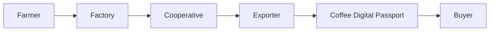

# SECURITY_AND_DATA_HANDLING

> Enterprise Security & Data Handling Overview for **framedInsight**

## Table of Contents
- Platform Overview
- Security Architecture
- Data Flow
- Data Classification
- Infrastructure & Encryption
- Identity & Access Management
- Application Security Controls
- Audit Logging
- Backup & Disaster Recovery
- Incident Response
- Threat Model
- EUDR Readiness
- Sub-processors
- Security Roadmap
- Contact

---

# Platform Overview
framedInsight is a multi-enterprise farm management and Coffee Digital Passport platform supporting Kenyan cooperatives, factories, exporters, and buyers.

# Security Architecture

```text
Farmer Apps
     │
     ▼
 Next.js / Vercel Edge
     │
 Authentication
     │
     ▼
 Supabase PostgreSQL
 ├── Row Level Security
 ├── Storage
 ├── Auth
 └── Audit Logs
     │
     ▼
 Coffee Digital Passport
     │
     ▼
 Buyer Data Room
```

## Mermaid Diagram



# Data Flow

1. Farmer delivers coffee.
2. Factory records intake and processing.
3. Cooperative aggregates export lots.
4. Passport is generated.
5. Buyers access a token-protected data room.

# Data Classification

| Classification | Examples |
|---|---|
| Public | Published passport |
| Internal | Factory operations |
| Confidential | Buyer details |
| Restricted | Authentication secrets |

# Infrastructure & Encryption

- Vercel hosting
- Supabase PostgreSQL
- TLS 1.2+
- Encryption at rest
- Private object storage
- Short-lived signed URLs
- HTTP-only cookies

# Identity & Access Management

- Supabase Auth
- Row Level Security
- Server-side authorization
- Revocable buyer tokens
- Principle of least privilege

# Application Security Controls

| Control | Status |
|---|---|
| CSP | ✅ |
| HSTS | ✅ |
| CSRF Protection | ✅ |
| Zod Validation | ✅ |
| Redis Rate Limiting | ✅ |
| Secure Cookies | ✅ |

# Audit Logging

The platform records:

- Authentication
- Passport publication
- Buyer access
- Downloads
- GeoJSON exports
- Administrative actions

# Backup & Disaster Recovery

- Automated PostgreSQL backups
- Managed storage redundancy
- Point-in-time recovery (where supported)
- Infrastructure redeployable from Git
- Recovery procedures documented

Recommended RPO: **< 1 hour**

Recommended RTO: **< 4 hours**

# Incident Response

1. Detect
2. Contain
3. Investigate
4. Remediate
5. Notify
6. Review

# Threat Model

| Threat | Mitigation |
|---|---|
| SQL Injection | Parameterized queries + validation |
| XSS | CSP + output encoding |
| CSRF | Signed CSRF tokens |
| Broken Access Control | RLS + ownership validation |
| Credential Theft | OTP authentication |
| Data Tampering | SHA-256 event chain |

# EUDR Readiness

- WGS84 coordinates
- Plot/polygon support
- Deforestation screening
- Chain of custody
- Buyer evidence package

# Sub-processors

| Provider | Purpose |
|---|---|
| Vercel | Hosting |
| Supabase | Database/Auth |
| Safaricom Daraja | Payments |
| LipaChat | WhatsApp |
| Anthropic/OpenAI | AI features |

# Security Roadmap

## Current
- Row Level Security
- Cryptographic ledger
- Buyer data room
- Signed URLs

## Planned
- Penetration testing
- ISO 27001 alignment
- SOC 2 readiness
- SIEM integration
- Vulnerability scanning
- Key rotation automation

# Contact

Security: langatlangs@gmail.com

Repository: https://github.com/Llangz/framedInsight-web
